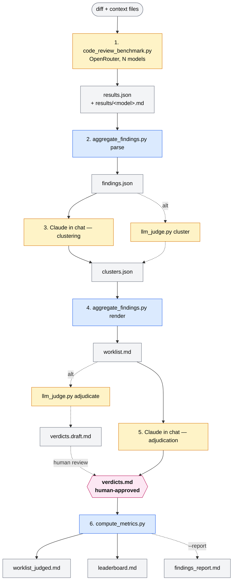

# Code Review Benchmark

[English](README.md) · [Русский](README.ru.md)

Scripts + methodology to compare how different LLMs do code review.
Take your diff, run it through N models, pile up the findings, dedupe them,
label each one with a verdict — and get precision, recall and hallucination
rate for every model.

Author: Svetlana Meleshkina. Licensed under [MIT](LICENSE).

## Why

Public benchmarks (SWE-bench, HumanEval, etc.) measure code generation.
Review is a different task and breaks differently: the model invents bugs
that aren't there, misses real ones, inflates severity, breaks the response
format.

This repo is a test harness that measures exactly that. On **your** diff,
so you can pick a model for **your** codebase, not somebody else's
leaderboard.

Two steps in the pipeline are deliberately kept manual — clustering the
findings and ruling on each cluster. The parsing and the summing-up are
done by code. The judgement calls are made by a human (with Claude in chat
helping).

## Scope: what this measures (and what it doesn't)

This bench measures a model in **bounded-context single-shot review** mode:
a diff plus N context files in a single call through the OpenRouter API —
no tool use, no follow-up questions, no access to the rest of the codebase.
That's deliberate: every model gets the same input, results are comparable,
runs are reproducible.

**What this bench does NOT measure:**

- **agentic review** — the model navigates the repo, reads callsites,
  verifies hypotheses by running code. That's no longer a model, it's a
  `model + tools` pipeline, and the leaderboard there may look different;
- **harness effect** — Copilot+Opus, Claude Code+Opus and a bare API+Opus
  call give different results on the same prompt;
- **reasoning outside the context block** — if a bug is only provable
  via a file you didn't pass in, nobody will catch it.

**When this bench applies:** picking a model for CI review, a PR-commenting
bot, or an IDE plugin with bounded context. For picking a model for
interactive review with tool use, you need a different harness — the
same diff, but run through Serena / an MCP wrapper.

**Sensitivity.** Results depend on the quality of the code in the diff
(the gap between models on messy code is not the same as on clean code)
and on the prompt ("prove each finding" measurably cuts the hallucination
rate). Run on several diffs of varying difficulty, and keep the prompt
fixed when comparing models.

## Pipeline



Legend: yellow — LLM calls (OpenRouter or Claude in chat), blue — Python
without LLM, pink — human checkpoint. Dashed = alternative path through
`llm_judge.py` for those without Claude Code.

**Principle:** Python scripts (parsing, rendering, metrics) don't call any
LLM. Everything that takes reasoning (clustering, adjudication) goes to
Claude in chat — usually free under your subscription. OpenRouter spend is
confined to step 1, where third-party models are exercised.

No Claude Code? There's an optional `llm_judge.py` — it runs clustering
and adjudication through OpenRouter. Output is a **draft**
(`verdicts.draft.md`) that you still read through before the metrics step.
Details [below](#automated-drafts-via-openrouter-optional).

## Install

```bash
pip install -r requirements.txt
```

OpenRouter API key: <https://openrouter.ai/keys>

```powershell
$env:OPENROUTER_API_KEY = "..."   # PowerShell
```
```bash
export OPENROUTER_API_KEY=...     # bash
```

## How to use

### 1. Run the models via OpenRouter

```bash
python code_review_benchmark.py path/to/some.diff \
  -c path/to/file1.cs \
  -c path/to/file2.cs \
  -o runs/<run-id>/results.json
```

Output:
- `results.json` — metadata + raw responses from every model
- `results/<model>.md` — one markdown file per model's review

**Models.** Default list — `models.json` (display name → OpenRouter model
id). Trim it to your quota or point to a different file with
`--models-file PATH`.

**Prompt.** Template at `prompts/review.en.txt`. There's also
`prompts/review.ru.txt` — Russian body with English field markers
(`Findings:`, `Location:`, …). Use your own with `--prompt PATH`.
Placeholders: `{diff}` and `{context_block}`.

### 2. Parse findings

```bash
python aggregate_findings.py parse \
  --results-dir results \
  -o findings.json
```

### 3. Clustering

Claude reads `findings.json` and groups findings by the underlying problem.
Result — `clusters.json`:

```json
{
  "clusters": [
    {"id": 1, "topic": "...", "consensus_severity": "major", "members": [<int idx>]}
  ]
}
```

**In Claude Code:** open the run folder and say:
> Read `findings.json`. Group the findings by the same underlying problem
> (rubric — `prompts/cluster.en.txt`). Write the result to `clusters.json`.

**Or automatically:**

```bash
python llm_judge.py cluster \
  --findings runs/<id>/findings.json \
  -o runs/<id>/clusters.json \
  --judge-model openai/gpt-5.5
```

### 4. Build the worklist

```bash
python aggregate_findings.py render \
  --findings findings.json \
  --clusters clusters.json \
  -o worklist.md
```

### 5. Adjudication

For each cluster, look at the source at the cited location and assign a
verdict: `real | smell | nit | wrong`. Result — `verdicts.md`:

```
## Cluster 1
- Verdict: real
- Confidence: high
- Reason: <one line>

## Cluster 2
...
```

**The human owns the final verdict.** Both paths below produce a draft.
Read it through and fix what needs fixing before computing metrics.

**In Claude Code:**
> For each cluster in `worklist.md` read the source at `Location:` and
> assign a verdict using the rubric in `prompts/judge.en.txt`. Write to
> `verdicts.md`.

**Or automatically** (output is `verdicts.draft.md` — rename to
`verdicts.md` after review):

```bash
python llm_judge.py adjudicate \
  --clusters runs/<id>/clusters.json \
  --findings runs/<id>/findings.json \
  --repo-path /path/to/repo \
  --context-lines 50 \
  -o runs/<id>/verdicts.draft.md \
  --judge-model openai/gpt-5.5
```

At the top of the draft is a "Needs human attention" preamble listing
clusters worth a closer look: low-confidence calls, severity disagreement
between models, singletons (only one model found it).

### 6. Compute metrics

```bash
python compute_metrics.py \
  --verdicts verdicts.md \
  --findings findings.json \
  --clusters clusters.json \
  --results results.json
```

Output:
- `worklist_judged.md` — worklist with `[x]` filled in and judge notes
  inlined (handy for verification, especially low-confidence clusters)
- `leaderboard.md` — results table: precision, recall, hallucination rate,
  $/real per model

### 7. Narrative report (optional)

Add `--report` and the script generates a report with auto-filled tables
(real bugs, who-found-what, severity calibration, cost/value) plus
`<!-- TODO -->` blocks for your commentary. Template —
`templates/findings_report.template.md`.

```bash
python compute_metrics.py \
  --verdicts runs/<id>/verdicts.md \
  --findings runs/<id>/findings.json \
  --clusters runs/<id>/clusters.json \
  --results  runs/<id>/results.json \
  --leaderboard runs/<id>/leaderboard.md \
  --report      runs/<id>/findings_report.md
```

Then you fill in the prose in the `<!-- TODO -->` blocks — for an article
or an internal team writeup.

## Automated drafts via OpenRouter (optional)

By default, clustering and adjudication run in Claude chat. If you don't
have Claude Code, or you want to run several judges for reproducibility —
there's `llm_judge.py`:

```bash
# Clustering
python llm_judge.py cluster \
  --findings runs/<id>/findings.json \
  -o runs/<id>/clusters.json \
  --judge-model openai/gpt-5.5

# Adjudication — produces verdicts.draft.md, NOT verdicts.md
python llm_judge.py adjudicate \
  --clusters runs/<id>/clusters.json \
  --findings runs/<id>/findings.json \
  --repo-path /path/to/repo \
  --context-lines 50 \
  -o runs/<id>/verdicts.draft.md \
  --judge-model openai/gpt-5.5
```

Rubrics live in `prompts/cluster.en.txt` and `prompts/judge.en.txt`. Tune
them to your codebase before relying on the output.

**Things to remember:**
- LLM-as-judge has known biases (position, length, self-preference). If
  the judge is from the same family as a model under review, that model
  gets a small head start. Run multiple judges for reproducibility.
- The judge sees only ±N lines around `Location:`, not the whole file or
  its callsites. If the verdict depends on caller code, the judge will
  mark `Confidence: low` and you'll need to walk the call sites by hand.
- The "human owns the final call" principle still holds: the file is
  named `verdicts.draft.md`. You rename it to `verdicts.md` only after
  review.

## Verdict categories

- **real** — a genuine bug with production impact: crash, wrong result,
  degraded behaviour on typical inputs, race, leak, data loss
- **smell** — code health, won't crash: duplication, bad names, missing
  docs, DRY violations, asymmetric APIs
- **nit** — pure style: whitespace, micro-optimisation, idiomatic preference
- **wrong** — the model is mistaken: the issue doesn't exist, the code was
  misread, or the recommendation doesn't apply

Disputed cases: real/smell → smell, smell/nit → nit, smell/wrong →
re-check, otherwise smell.

## Format compatibility

Not every model follows the format perfectly. `aggregate_findings.py` has
an `ISSUE_RE` regex that's tolerant to the common deviations (`**bold**`,
`1.` instead of `1)`, severity wrapped in markdown, etc.) plus a
`FORMAT_NOTES = {}` dictionary for "parses but with caveats" annotations.
Your notes appear next to the model in `worklist.md` so reviewers give
those findings a bit of extra scrutiny. Fill it from your own runs;
mechanics — in
[CONTRIBUTING.md](CONTRIBUTING.md#format-compliance-notes).

Both parsers expect the English field markers from `prompts/review.en.txt`:
`Findings:`, `Location:`, `Why it matters:`, `Evidence:`, `Recommendation:`,
plus `[severity: blocker/major/minor/nit]`. Change the markers — update
the regexes.

## Repository layout

```
ai-code-review-benchmark/
├── README.md
├── README.ru.md
├── LICENSE
├── requirements.txt
├── code_review_benchmark.py        ← runner: runs models through OpenRouter
├── aggregate_findings.py           ← parses findings + builds worklist (no LLM)
├── compute_metrics.py              ← metrics + results table + report (no LLM)
├── llm_judge.py                    ← optional: clustering/adjudication drafts
├── models.json                     ← default model list
├── prompts/
│   ├── review.en.txt               ← reviewer prompt (step 1)
│   ├── review.ru.txt               ← Russian body + English markers
│   ├── cluster.en.txt              ← clustering rubric (step 3)
│   └── judge.en.txt                ← adjudication rubric (step 5)
├── templates/
│   └── findings_report.template.md ← skeleton for --report
└── runs/                           ← .gitignored — local runs
    └── <run-id>/
        ├── input.diff
        ├── results.json
        ├── results/
        ├── findings.json
        ├── clusters.json
        ├── worklist.md
        ├── verdicts.draft.md
        ├── verdicts.md
        ├── worklist_judged.md
        ├── leaderboard.md
        └── findings_report.md
```

**Run id:** `runs/<short-id>/` — a ticket (`PROJ-1234`), a feature
(`auth-refactor`) or a date (`2026-05-09-deepseek-only`). All artefacts of
one run live in one folder.

`runs/` is in `.gitignore` so runs against private code don't leak into
the public repo. Drop the line only if the run is fully public.

## Files

### Scripts

| File | What it does |
|---|---|
| `code_review_benchmark.py` | Runner: runs models through OpenRouter (step 1) |
| `aggregate_findings.py` | Parses findings + builds the worklist; doesn't call any LLM |
| `compute_metrics.py` | Metrics + results table + findings_report; doesn't call any LLM |
| `llm_judge.py` | Optional: drafts clustering and adjudication via OpenRouter |
| `models.json` | `{display_name: openrouter_model_id}`; keys starting with `_` are comments |
| `prompts/review.en.txt` | Step 1 prompt; placeholders `{diff}`, `{context_block}` |
| `prompts/review.ru.txt` | Russian body + English markers |
| `prompts/cluster.en.txt` | Step 3 rubric; placeholder `{findings_block}` |
| `prompts/judge.en.txt` | Step 5 rubric; placeholders `{cluster_id}`, `{cluster_topic}`, `{cluster_severity}`, `{cluster_findings}`, `{source_excerpt}`, `{source_status}` |
| `templates/findings_report.template.md` | Skeleton with `{TOKEN}` placeholders and `<!-- TODO -->` blocks |

### Run artefacts (`runs/<run-id>/`)

| File | What it is | Producer |
|---|---|---|
| `input.diff` | Unified diff | you (`git diff > input.diff`) |
| `results.json` | Metadata + raw model responses. Per-model `cost` and `reasoning_tokens` from OpenRouter (may be `null`). | `code_review_benchmark.py` |
| `results/<model>.md` | One model's review: `Findings:` with numbered items and sub-items `Location:`, `Why it matters:`, `Evidence:`, `Recommendation:` | `code_review_benchmark.py` |
| `findings.json` | `{issues: [{model, severity, summary, location, why_it_matters, evidence, recommendation}]}` | `aggregate_findings.py parse` |
| `clusters.json` | `{clusters: [{id, topic, consensus_severity, members: [int]}]}` | Claude in chat / `llm_judge.py cluster` |
| `worklist.md` | Clusters with `[ ]` checkboxes, ready for labelling | `aggregate_findings.py render` |
| `verdicts.draft.md` | Draft verdicts + "Needs human attention" preamble. After review → `verdicts.md` | `llm_judge.py adjudicate` |
| `verdicts.md` | Per-cluster verdicts (`## Cluster N`, `Verdict:`, `Confidence:`, `Reason:`) | Claude in chat / human review of the draft |
| `worklist_judged.md` | Worklist with `[x]` and judge notes | `compute_metrics.py` |
| `leaderboard.md` | Precision, recall, hallucination rate, $/real | `compute_metrics.py` |
| `findings_report.md` | Narrative report with tables and `<!-- TODO -->` blocks for prose | `compute_metrics.py --report` |
| `cost_estimates.json` | **Override only.** Cost is normally read from `results.json`. This file is for models routed outside OpenRouter, or when `usage.cost` is `null`. Keys are sanitised names: `re.sub(r"[^\w\-]+", "_", name)` | you (optional) |

## How to contribute

[CONTRIBUTING.md](CONTRIBUTING.md) — how to add a model, tweak the prompt,
or update the parser regexes.
