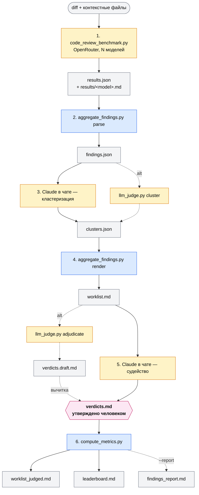

# Code Review Benchmark

[English](README.md) · [Русский](README.ru.md)

> **Один diff. N моделей. Лидерборд, который имеет значение именно для твоей кодовой базы.**

Сравни, как разные LLM ревьюят *твой* код. Возьми реальный diff, прогони
через несколько моделей, разметь находки человеком и получь по каждой модели
**precision, recall и hallucination rate** — на твоём коде, а не на чужих
игрушечных задачах.

- **Используй**, если выбираешь модель для CI-ревью, PR-бота или IDE-плагина
  с ограниченным контекстом.
- **Не используй**, если нужно агентское ревью с навигацией по всему репо
  и вызовом инструментов — для этого нужен другой стенд (см. раздел
  [Что меряется](#что-именно-меряется-и-что-нет)).

Автор: Светлана Мелешкина. Лицензия — [MIT](LICENSE).

## Зачем

Публичные бенчмарки (SWE-bench, HumanEval и пр.) меряют генерацию кода.
Ревью — другая задача, и ломается оно по-другому: модель придумывает баги,
которых нет, пропускает настоящие, раздувает severity, ломает формат ответа.

Этот репо — тестовый стенд, который меряет именно это. На **твоём** diff'е,
чтобы выбрать модель под **твою** кодовую базу, а не под чужую таблицу рекордов.

Два шага в пайплайне намеренно оставлены «ручными» — кластеризация находок
и вердикт по каждому кластеру. Парсинг и сводку делает код. Суждения —
человек (с помощью Claude в чате).

## Что именно меряется (и что нет)

Стенд меряет модель в режиме **bounded-context single-shot review**:
diff + N контекстных файлов одним вызовом через OpenRouter API, без
tool use, без follow-up вопросов, без доступа к остальной кодобазе.
Это специально: одинаковый вход всем моделям, результаты сравнимы,
прогон воспроизводим.

**Что стенд НЕ меряет:**

- **агентский режим** — модель ходит по репо, читает callsite'ы,
  проверяет гипотезы прогоном кода. Это уже не модель, а pipeline
  `модель + tools`, и лидеры там могут оказаться другие;
- **влияние harness'а** — Copilot+Opus, Claude Code+Opus и голый API+Opus
  на одном промпте дают разные результаты;
- **рассуждение за пределами context_block** — если баг доказывается
  через файл, который ты не передал, его никто не поймает.

**Когда применимо:** выбор модели под CI-ревью, PR-комментирующего бота,
IDE-плагин с ограниченным контекстом. Для интерактивного review с
tool use нужен другой стенд — тот же diff, но через Serena / MCP-обёртку.

**Чувствительность.** Результаты зависят от качества кода в diff'е
(разрыв между моделями на «грязном» коде — не то же, что на чистом)
и от промпта (требование «докажи каждую находку» заметно режет
hallucination rate). Прогоняй на нескольких diff'ах разной сложности
и фиксируй промпт при сравнении моделей.

## Pipeline



Легенда: жёлтый — LLM-вызовы (OpenRouter или Claude в чате), синий —
Python без LLM, розовый — человеческий чекпоинт. Пунктир — альтернативный
путь через `llm_judge.py` для тех, у кого нет Claude Code.

**Принцип:** Python-скрипты (парсинг, рендеринг, метрики) LLM не зовут.
Всё, что требует рассуждения (кластеризация, судейство), делает Claude
в чате — обычно бесплатно по подписке. OpenRouter тратится только на
шаге 1, где гоняются сторонние модели.

Нет Claude Code? Есть опциональный `llm_judge.py` — он делает кластеризацию
и судейство через OpenRouter. На выходе **черновик** (`verdicts.draft.md`),
который ты всё равно вычитываешь перед метриками. Подробности —
[ниже](#автоматические-черновики-через-openrouter-опционально).

## Установка

```bash
pip install -r requirements.txt
```

API-ключ OpenRouter: <https://openrouter.ai/keys>

```powershell
$env:OPENROUTER_API_KEY = "..."   # PowerShell
```
```bash
export OPENROUTER_API_KEY=...     # bash
```

## Быстрый старт

```bash
# 1. Прогон моделей на твоём diff
python code_review_benchmark.py my.diff -c file.cs -o runs/demo/results.json

# 2. Парсинг находок
python aggregate_findings.py parse --results-dir runs/demo/results -o runs/demo/findings.json

# 3. Кластеризация (Claude в чате или llm_judge.py cluster)
# 4. Сборка worklist
python aggregate_findings.py render --findings runs/demo/findings.json \
  --clusters runs/demo/clusters.json -o runs/demo/worklist.md

# 5. Судейство (Claude в чате или llm_judge.py adjudicate)
# 6. Подсчёт метрик
python compute_metrics.py --verdicts runs/demo/verdicts.md \
  --findings runs/demo/findings.json --clusters runs/demo/clusters.json \
  --results runs/demo/results.json --leaderboard runs/demo/leaderboard.md
```

Шаги 3 и 5 требуют человеческого суждения — подробности ниже.

## Как пользоваться

### 1. Прогон моделей через OpenRouter

```bash
python code_review_benchmark.py path/to/some.diff \
  -c path/to/file1.cs \
  -c path/to/file2.cs \
  -o runs/<run-id>/results.json
```

На выходе:
- `results.json` — мета + сырые ответы всех моделей
- `results/<model>.md` — ревью каждой модели отдельным файлом

**Модели.** Список по умолчанию — `models.json` (display name → OpenRouter
model id). Подрежь под свою квоту или укажи другой файл: `--models-file PATH`.

**Промт.** Шаблон в `prompts/review.en.txt`. Есть `prompts/review.ru.txt` —
русское тело с английскими маркерами полей (`Findings:`, `Location:` и т.д.).
Свой путь — `--prompt PATH`. Подстановки: `{diff}` и `{context_block}`.

### 2. Парсинг находок

```bash
python aggregate_findings.py parse \
  --results-dir results \
  -o findings.json
```

### 3. Кластеризация

Claude читает `findings.json` и группирует находки по сути проблемы.
Результат — `clusters.json`:

```json
{
  "clusters": [
    {"id": 1, "topic": "...", "consensus_severity": "major", "members": [<int idx>]}
  ]
}
```

**В Claude Code:** открой папку прогона и скажи:
> Прочитай `findings.json`. Сгруппируй находки по сути проблемы (рубрика —
> `prompts/cluster.en.txt`). Запиши результат в `clusters.json`.

**Или автоматически:**

```bash
python llm_judge.py cluster \
  --findings runs/<id>/findings.json \
  -o runs/<id>/clusters.json \
  --judge-model openai/gpt-5.5
```

### 4. Сборка worklist'а

```bash
python aggregate_findings.py render \
  --findings findings.json \
  --clusters clusters.json \
  -o worklist.md
```

### 5. Судейство

По каждому кластеру нужно посмотреть исходный код в указанном месте и
вынести вердикт: `real | smell | nit | wrong`. Результат — `verdicts.md`:

```
## Cluster 1
- Verdict: real
- Confidence: high
- Reason: <одна строка>

## Cluster 2
...
```

**Финальный вердикт — за человеком.** Оба пути ниже дают черновик.
Вычитай и поправь, прежде чем считать метрики.

**В Claude Code:**
> Для каждого кластера в `worklist.md` прочитай исходный код по `Location:`
> и вынеси вердикт по рубрике из `prompts/judge.en.txt`. Запиши в `verdicts.md`.

**Или автоматически** (на выходе `verdicts.draft.md` — переименуешь в
`verdicts.md` после ревью):

```bash
python llm_judge.py adjudicate \
  --clusters runs/<id>/clusters.json \
  --findings runs/<id>/findings.json \
  --repo-path /path/to/repo \
  --context-lines 50 \
  -o runs/<id>/verdicts.draft.md \
  --judge-model openai/gpt-5.5
```

В черновике сверху — преамбула «Needs human attention» с кластерами,
на которые стоит посмотреть внимательнее: low-confidence, расхождения
в severity между моделями, уникальные находки (нашла только одна модель).

### 6. Метрики

```bash
python compute_metrics.py \
  --verdicts verdicts.md \
  --findings findings.json \
  --clusters clusters.json \
  --results results.json
```

На выходе:
- `worklist_judged.md` — worklist с проставленными `[x]` и заметками судьи
  (удобно для верификации, особенно по low-confidence кластерам)
- `leaderboard.md` — таблица результатов: precision, recall, hallucination rate, $/real по каждой модели

### 7. Нарративный отчёт (опционально)

Добавь `--report` — скрипт сгенерирует отчёт с заполненными таблицами
(real-баги, кто что нашёл, severity calibration, cost/value) и
`<!-- TODO -->` блоками под твои комментарии. Шаблон —
`templates/findings_report.template.md`.

```bash
python compute_metrics.py \
  --verdicts runs/<id>/verdicts.md \
  --findings runs/<id>/findings.json \
  --clusters runs/<id>/clusters.json \
  --results  runs/<id>/results.json \
  --leaderboard runs/<id>/leaderboard.md \
  --report      runs/<id>/findings_report.md
```

Дальше дописываешь прозу в `<!-- TODO -->` блоках — для статьи или
внутренней рассылки команде.

## Автоматические черновики через OpenRouter (опционально)

По умолчанию кластеризация и судейство делаются в Claude в чате. Если
Claude Code нет, или хочется прогнать несколько судей для воспроизводимости —
есть `llm_judge.py`:

```bash
# Кластеризация
python llm_judge.py cluster \
  --findings runs/<id>/findings.json \
  -o runs/<id>/clusters.json \
  --judge-model openai/gpt-5.5

# Судейство — выдаёт verdicts.draft.md, НЕ verdicts.md
python llm_judge.py adjudicate \
  --clusters runs/<id>/clusters.json \
  --findings runs/<id>/findings.json \
  --repo-path /path/to/repo \
  --context-lines 50 \
  -o runs/<id>/verdicts.draft.md \
  --judge-model openai/gpt-5.5
```

Рубрики — в `prompts/cluster.en.txt` и `prompts/judge.en.txt`. Подкрути
под свою кодбазу, прежде чем полагаться на результат.

**О чём помнить:**
- LLM-as-judge подвержен известным искажениям (position, length, self-preference). Если
  судья из той же семьи, что и модель под судом — она получит небольшую фору.
  Для воспроизводимости гоняй несколько судей.
- Судья видит ±N строк вокруг `Location:`, не весь файл и не callsite'ы.
  Если вердикт зависит от вызывающего кода, судья пометит `Confidence: low`,
  и тебе придётся идти смотреть руками.
- Принцип «финальный вердикт за человеком» сохраняется: файл называется
  `verdicts.draft.md`. В `verdicts.md` переименовываешь только после ревью.

## Категории вердиктов

- **real** — настоящий баг с production-impact: краш, неверный результат,
  деградация на типичных данных, race, утечка, потеря данных
- **smell** — code health, не упадёт: дублирование, плохие имена,
  missing docs, DRY-нарушения, асимметрия API
- **nit** — чистый стиль: whitespace, micro-opt, idiomatic preferences
- **wrong** — модель ошиблась: проблема не существует, код неправильно понят,
  рекомендация не применима

Спорные случаи: real/smell → smell, smell/nit → nit, smell/wrong →
перепроверь, иначе smell.

## Совместимость форматов

Не все модели идеально следуют формату. В `aggregate_findings.py` есть
regex `ISSUE_RE`, устойчивый к типичным отклонениям (`**bold**`, `1.`
вместо `1)`, severity в markdown и т.п.), плюс словарь `FORMAT_NOTES = {}`
для пометок «модель парсится, но с оговорками». Твои записи показываются
рядом с моделью в `worklist.md`, чтобы присматриваться к её находкам
чуть внимательнее. Заполняй по наблюдениям; механика — в
[CONTRIBUTING.md](CONTRIBUTING.md#format-compliance-notes).

Оба парсера ждут английских маркеров полей из `prompts/review.en.txt`:
`Findings:`, `Location:`, `Why it matters:`, `Evidence:`, `Recommendation:`
плюс `[severity: blocker/major/minor/nit]`. Меняешь маркеры — обнови regex'ы.

## Структура репозитория

```
ai-code-review-benchmark/
├── README.md
├── README.ru.md
├── LICENSE
├── requirements.txt
├── code_review_benchmark.py        ← раннер: гоняет модели через OpenRouter
├── aggregate_findings.py           ← парсинг находок + сборка worklist (без LLM)
├── compute_metrics.py              ← метрики + таблица результатов + отчёт (без LLM)
├── llm_judge.py                    ← опционально: черновики кластеризации/судейства
├── models.json                     ← список моделей по умолчанию
├── prompts/
│   ├── review.en.txt               ← промт ревьюера (шаг 1)
│   ├── review.ru.txt               ← русское тело + английские маркеры
│   ├── cluster.en.txt              ← рубрика кластеризации (шаг 3)
│   └── judge.en.txt                ← рубрика судейства (шаг 5)
├── templates/
│   └── findings_report.template.md ← скелет для --report
└── runs/                           ← .gitignore — локальные прогоны
    └── <run-id>/
        ├── input.diff
        ├── results.json
        ├── results/
        ├── findings.json
        ├── clusters.json
        ├── worklist.md
        ├── verdicts.draft.md
        ├── verdicts.md
        ├── worklist_judged.md
        ├── leaderboard.md
        └── findings_report.md
```

**ID прогона:** `runs/<short-id>/` — тикет (`PROJ-1234`), фича
(`auth-refactor`) или дата (`2026-05-09-deepseek-only`). Все артефакты
прогона — в одной папке.

`runs/` в `.gitignore`, чтобы прогоны на приватном коде не утекли
в публичный репо. Убирай только если прогон полностью публичный.

## Файлы

### Скрипты

| Файл | Что делает |
|---|---|
| `code_review_benchmark.py` | Раннер: гоняет модели через OpenRouter (шаг 1) |
| `aggregate_findings.py` | Парсинг находок + сборка worklist'а, LLM не зовёт |
| `compute_metrics.py` | Метрики + таблица результатов + findings_report, LLM не зовёт |
| `llm_judge.py` | Опционально: черновики кластеризации и судейства через OpenRouter |
| `models.json` | `{display_name: openrouter_model_id}`, ключи на `_` — комментарии |
| `prompts/review.en.txt` | Промт шага 1; плейсхолдеры `{diff}`, `{context_block}` |
| `prompts/review.ru.txt` | Русское тело + английские маркеры |
| `prompts/cluster.en.txt` | Рубрика шага 3; плейсхолдер `{findings_block}` |
| `prompts/judge.en.txt` | Рубрика шага 5; плейсхолдеры `{cluster_id}`, `{cluster_topic}`, `{cluster_severity}`, `{cluster_findings}`, `{source_excerpt}`, `{source_status}` |
| `templates/findings_report.template.md` | Скелет с `{TOKEN}` плейсхолдерми и `<!-- TODO -->` блоками |

### Артефакты прогона (`runs/<run-id>/`)

| Файл | Что это | Кто создаёт |
|---|---|---|
| `input.diff` | Unified diff | ты (`git diff > input.diff`) |
| `results.json` | Мета + сырые ответы моделей. Per-model `cost` и `reasoning_tokens` из OpenRouter (могут быть `null`). | `code_review_benchmark.py` |
| `results/<model>.md` | Ревью одной модели: `Findings:` с пронумерованными пунктами и подпунктами `Location:`, `Why it matters:`, `Evidence:`, `Recommendation:` | `code_review_benchmark.py` |
| `findings.json` | `{issues: [{model, severity, summary, location, why_it_matters, evidence, recommendation}]}` | `aggregate_findings.py parse` |
| `clusters.json` | `{clusters: [{id, topic, consensus_severity, members: [int]}]}` | Claude в чате / `llm_judge.py cluster` |
| `worklist.md` | Кластеры с `[ ]`-чекбоксами, готовые к разметке | `aggregate_findings.py render` |
| `verdicts.draft.md` | Черновик вердиктов + преамбула «Needs human attention». После ревью → `verdicts.md` | `llm_judge.py adjudicate` |
| `verdicts.md` | Вердикты по кластерам (`## Cluster N`, `Verdict:`, `Confidence:`, `Reason:`) | Claude в чате / ручное ревью черновика |
| `worklist_judged.md` | Worklist с `[x]` и заметками судьи | `compute_metrics.py` |
| `leaderboard.md` | Precision, recall, hallucination rate, $/real | `compute_metrics.py` |
| `findings_report.md` | Нарративный отчёт с таблицами и `<!-- TODO -->` под прозу | `compute_metrics.py --report` |
| `cost_estimates.json` | **Только override.** Cost обычно берётся из `results.json`. Этот файл — для моделей вне OpenRouter или когда `usage.cost` = `null`. Ключи — нормализованные имена: `re.sub(r"[^\w\-]+", "_", name)` | ты (опционально) |

## Как участвовать

[CONTRIBUTING.md](CONTRIBUTING.md) — как добавить модель, поменять промт
или обновить regex'ы парсеров.